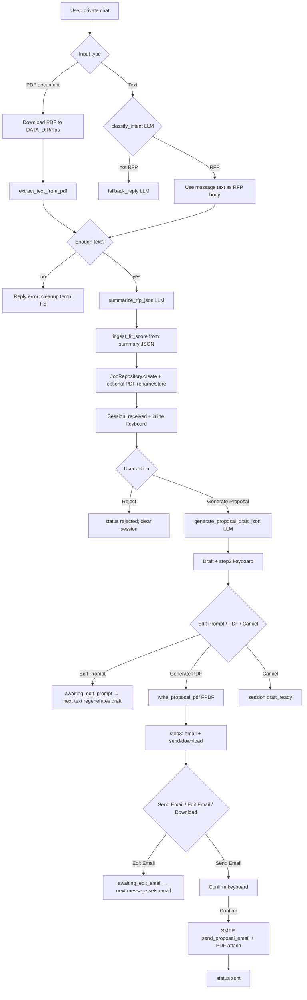

# RFP Telegram Bot — Top-Level Flow

## Purpose

A Telegram bot (private chats) that ingests RFPs from **PDF** or **pasted text**, summarizes them with an LLM, scores fit, drafts a proposal, can render a **PDF**, and optionally **emails** the proposal via SMTP. State is tracked per user in SQLite.

## Stack (at a glance)

| Layer | Role |
|--------|------|
| `bot.py` | Thin entry: calls `app.main.run()` |
| `app/main.py` | Builds `python-telegram-bot` `Application`, `init_db()`, registers handlers, `run_polling()` |
| `config.py` | Loads `.env.development`; paths for data/DB/RFPs/proposals; Telegram, Gemini, SMTP |
| `app/controllers/rfp_handlers.py` | Commands, messages, inline callbacks — orchestrates the pipeline |
| `app/services/*` | PDF text, Gemini calls, scoring, PDF generation, SMTP |
| `app/storage/*` | SQLite schema + `JobRepository` / `UserSessionRepository` |

## Startup

1. `python bot.py` → `run()` in `app/main.py`.
2. Validate `BOT_TOKEN` (raises if missing).
3. `init_db()` — ensure `data/` dirs and create `jobs` + `user_sessions` tables if needed.
4. Register handlers: `/start`, `/help`, all `CallbackQuery`, private `TEXT` + `Document.PDF`.
5. Start long polling against Telegram.

## High-level user journey

## Ingestion (`_ingest_and_reply`)

1. Merge optional caption with extracted/pasted text; require minimum length (~40 chars).
2. **LLM** `summarize_rfp_json` → structured JSON (title, client, summary bullets, `client_email`, `fit_score`, etc.).
3. **Score**: `ingest_fit_score` clamps model `fit_score` to 0–10.
4. **Persist**: insert `jobs` row (`status=received`, `summary` JSON string, `score`, `email` if present).
5. If source was PDF: move temp file to `RFPS_DIR` with `build_stored_pdf_name`, update `file_path`.
6. **Session**: `current_job_id`, `current_step=received`.
7. Reply with summary + fit + **Step 1** keyboard: *Generate Proposal* / *Reject*.

## Callback short codes (`callback_router`)

| Prefix | Meaning |
|--------|---------|
| `gp` | Generate proposal draft |
| `rj` | Reject job |
| `ep` | Enter “awaiting_edit_prompt” |
| `pdf` | Build proposal PDF under `PROPOSALS_DIR` |
| `se` | Prompt email confirmation |
| `ee` | Enter “awaiting_edit_email” |
| `cf` | Confirm send (SMTP) |
| `cx` | Cancel (context: email confirm vs general) |
| `dl` | Reply with PDF document |

Ownership: callbacks only apply if `job.user_id` matches `query.from_user.id`.

## External services

- **Telegram Bot API** — transport and file download.
- **Google Gemini** (`google.genai`, model `gemini-2.5-flash`) — classifier, ingest JSON, proposal draft, `/start`/`/help`/fallback copy (`app/prompts.py` + `llm_service.py`).
- **SMTP** — optional; `send_proposal_email` when `SMTP_HOST` and `SMTP_FROM` are set.

## Persistence

- **`jobs`**: one row per RFP pipeline (text, summary JSON, score, proposal JSON, email, file path, status).
- **`user_sessions`**: per `user_id` — `current_job_id`, `current_step`, `pending_input` for multi-step flows (edit prompt, edit email, email confirm).

## Configuration touchpoints

- `BOT_TOKEN`, `API_KEY` (Gemini), optional `DATA_DIR`.
- SMTP: `SMTP_HOST`, `SMTP_PORT`, `SMTP_USER`, `SMTP_PASSWORD`, `SMTP_FROM`.
